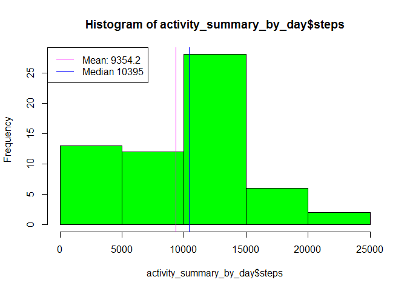
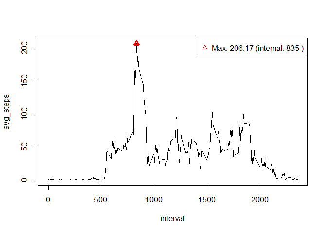
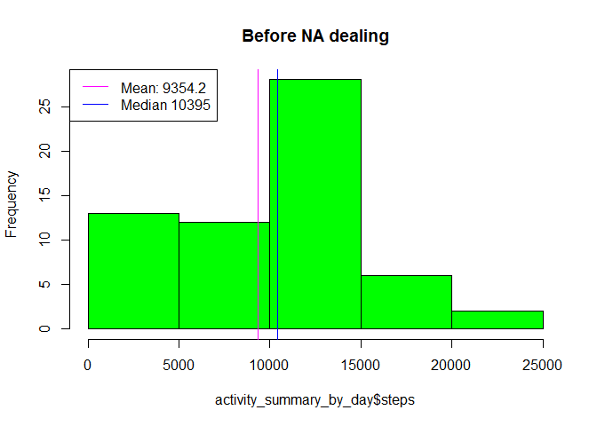
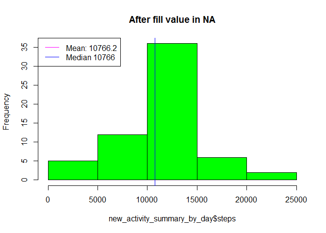
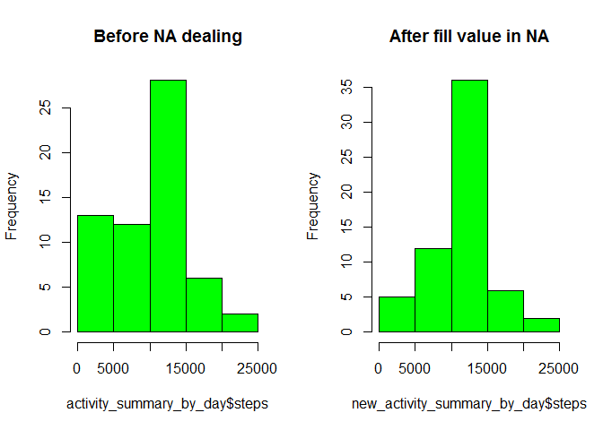
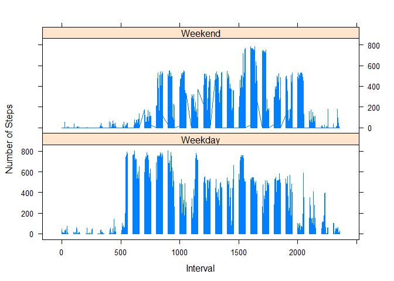

# Reproducible Research: Peer Assessment 1

##Introduction

It is now possible to collect a large amount of data about personal movement using activity monitoring devices such as a Fitbit, Nike Fuelband, or Jawbone Up. These type of devices are part of the "quantified self" movement - a group of enthusiasts who take measurements about themselves regularly to improve their health, to find patterns in their behavior, or because they are tech geeks. But these data remain under-utilized both because the raw data are hard to obtain and there is a lack of statistical methods and software for processing and interpreting the data.

This assignment makes use of data from a personal activity monitoring device. This device collects data at 5 minute intervals through out the day. The data consists of two months of data from an anonymous individual collected during the months of October and November, 2012 and include the number of steps taken in 5 minute intervals each day.

The data for this assignment can be downloaded from the course web site:

Dataset: Activity monitoring data [52K]
The variables included in this dataset are:

steps: Number of steps taking in a 5-minute interval (missing values are coded as NA)

date: The date on which the measurement was taken in YYYY-MM-DD format

interval: Identifier for the 5-minute interval in which measurement was taken

first, download the zip file from 
https://github.com/rdpeng/RepData_PeerAssessment1/blob/master/activity.zip

second, extract it and put it in the r working folder.

## Loading and preprocessing the data

Load the data

```r
activity<-read.csv("activity.csv")
```
Process/transform the data (if necessary) into a format suitable for your analysis

## What is mean total number of steps taken per day?


```r
#load data.table, install it if needed.
if(!require('data.table')){
    install.packages('data.table')
}
```

```
## Loading required package: data.table
```

```r
library(data.table)
activity_table=data.table(activity)
activity_summary_by_day=activity_table[,list(steps=sum(steps,na.rm=T)),by=date]
mean_by_day=mean(activity_summary_by_day$steps)
median_by_day=median(activity_summary_by_day$steps)
#plot
hist(activity_summary_by_day$steps, col="green")
abline(v=mean_by_day,col="magenta")
abline(v=median_by_day,col="blue")
legend("topleft",lty=1,lwd=1,col=c("magenta","blue"),legend = c(paste("Mean:",round(mean_by_day,1)),paste("Median",median_by_day)))
```

 

## What is the average daily activity pattern?


```r
activity_summary_by_interval=activity_table[,list(avg_steps=mean(steps,na.rm=T)),by=interval]
plot(avg_steps~interval, activity_summary_by_interval, type="l")
max_steps_at=activity_summary_by_interval[which.max(avg_steps)]
#the max point
points(max_steps_at$interval,max_steps_at$avg_steps,col="red",lwd=3,pch=2)
legend("topright",legend=paste("Max:",round( max_steps_at$avg_steps,2),"(internal:",max_steps_at$interval,")"),col=c("red"),pch=2)
```

 

## Imputing missing values
1.Calculate and report the total number of missing values in the dataset

```r
#Missing Value Count
sum(is.na(activity$steps))
```

```
## [1] 2304
```
2.Devise a strategy for filling in all of the missing values in the dataset. The strategy does not need to be sophisticated. For example, you could use the mean/median for that day, or the mean for that 5-minute interval, etc.

3.Create a new dataset that is equal to the original dataset but with the missing data filled in.


```r
#Create a function that replace NA

Replace_NA = function(x,y){
        if(is.na(x)){

                return(y)
        }
        return(x)
}

#Set Keys
setkey(activity_table, interval)
setkey(activity_summary_by_interval, interval)

new_activity = activity_table[activity_summary_by_interval]
new_activity$new_steps = mapply(Replace_NA,new_activity$steps, new_activity$avg_steps)
```
4.Make a histogram of the total number of steps taken each day and Calculate and report the mean and median total number of steps taken per day. Do these values differ from the estimates from the first part of the assignment? What is the impact of imputing missing data on the estimates of the total daily number of steps?


```r
new_activity_summary_by_day=new_activity[,list(steps=sum(new_steps,na.rm=T)),by=date]
new_mean_by_day=mean(new_activity_summary_by_day$steps)
new_median_by_day=median(new_activity_summary_by_day$steps)
#put to plot together so that we can compare
#par(mfrow=c(2,1)) ~ not a good idea, too small.
#repeat the previous plot~Before NA dealing
hist(activity_summary_by_day$steps, col="green",main = "Before NA dealing")
abline(v=mean_by_day,col="magenta")
abline(v=median_by_day,col="blue")
legend("topleft",lty=1,lwd=1,col=c("magenta","blue"),legend = c(paste("Mean:",round(mean_by_day,1)),paste("Median",median_by_day)))
```

 

```r
#new plot~After NA dealing
hist(new_activity_summary_by_day$steps, col="green",main = "After fill value in NA")
abline(v=new_mean_by_day,col="magenta")
abline(v=new_median_by_day,col="blue")
legend("topleft",lty=1,lwd=1,col=c("magenta","blue"),legend = c(paste("Mean:",round(new_mean_by_day,1)),paste("Median",round(new_median_by_day))))
```

 

```r
par(mfrow=c(1,2))
hist(activity_summary_by_day$steps, col="green",main = "Before NA dealing")
hist(new_activity_summary_by_day$steps, col="green",main = "After fill value in NA")
```

 

Comparing with the previous table, the mean and median are the same.

## Are there differences in activity patterns between weekdays and weekends?

For this part the weekdays() function may be of some help here. Use the dataset with the filled-in missing values for this part.

1.Create a new factor variable in the dataset with two levels - "weekday" and "weekend" indicating whether a given date is a weekday or weekend day.


```r
activity_table$dayname = weekdays(as.Date(activity_table$date))
activity_table$isWeekend=activity_table$dayname %in% c("Saturday","Sunday")
#create two tables for weekdays and weekends
activity_summary_by_interval_weekend=activity_table[activity_table$isWeekend,list(steps=sum(steps,na.rm=T)),by=interval]
activity_summary_by_interval_weekday=activity_table[!activity_table$isWeekend,list(steps=sum(steps,na.rm=T)),by=interval]
DayTypeFunc=function(condition){
  if(condition==T)
  {
    return("Weekend")
  }
  return("Weekday")
}
activity_table$DayType=mapply(DayTypeFunc,activity_table$isWeekend)
```

2.Make a panel plot containing a time series plot (i.e. type = "l") of the 5-minute interval (x-axis) and the average number of steps taken, averaged across all weekday days or weekend days (y-axis). See the README file in the GitHub repository to see an example of what this plot should look like using simulated data.


```r
#plot
library(lattice)
xyplot(steps~interval | DayType, data = activity_table,
      type = 'l',
      xlab = 'Interval',
      ylab = 'Number of Steps',
      layout = c(1,2))
```

 

From the above table, we conclude that this person starts activities at 9 am in weekdays and 10 am in weekends.
